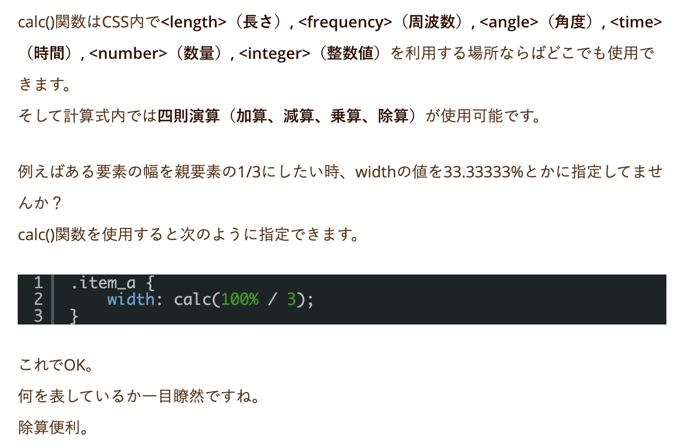

# position :sticky;
  * position: sticky;とは、ヘッダやナビゲーション、サイドバーなど指定した要素をスクロールした際にぴたっと指定した位置に貼り付ける（スティッキー）便利なプロパティです。
```css
.top {
  position:sticky;
  top: 0;
  left: 0;
  z-index: 1;
}
```

# calc() //カルク関数
  * プロパティの値を計算式で実行することができます。


# line-height 3つの書き方
  1. px、emなど（30px、20em）で数値を指定
  > 純粋に行間のサイズを単位で指定
  2. 数値のみ（5、20など）で指定
  > フォントサイズに対して、数値分かけた高さに行間のサイズを指定
  1. %（50%など）で指定
  > 行間のサイズをフォントサイズの％分かけた数値に行間を指定